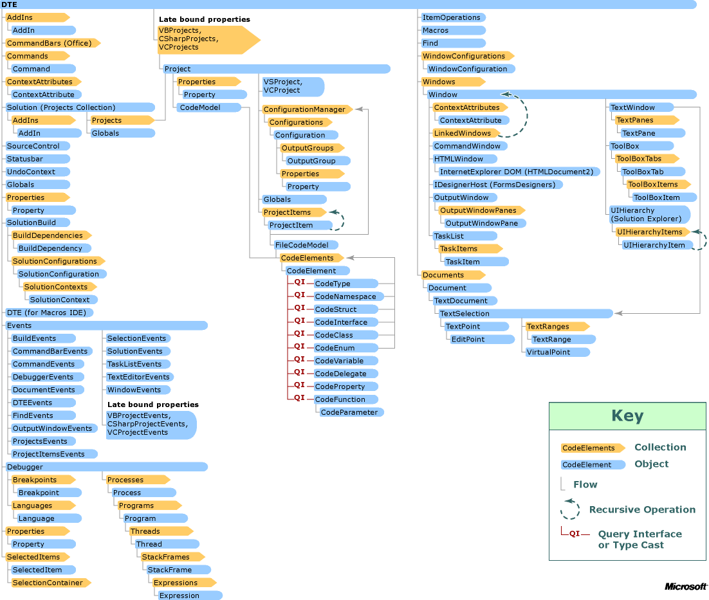

# 🤖 Otomasyon \| VS Extension

## 🐥 Visual Studio Ortam Objelerine Erişme

* 💠 IDE objelerine erişmek için `EnvDT80.DTE2` objesi kullanılır
* 🍎 `await <asyncServiceProvider>.GetServiceAsync(typeof(DTE)).ConfigureAwait(false) as DTE2` kodu ile DTE objesi alınır
* 📂 `dte2.ItemOperations` kodu ile dosya açma, ekleme ve benzeri işlemler IDE ile otomatikleştirilebilir

| Kod | Açıklama |
| :--- | :--- |
| `dte2.ActiveDocument` | IDE üzerinde aktif olan doküman |
| `dte2.ActiveDocument.ProjectItem` | Aktif dokümanın proje objesi \(kaynak kodlara vb erişim\) |
| `dte2.ToolWindows.SolutionExplorer.SelectedItems` | Solution Explorer üzerindeki seçilen dosyalara erişiriz |
| `dte2.ExecuteCommand("<komut>", "<argümanlar>")` | Command Window üzerinde komut çalıştırır |
| `dte2.ItemOperations.AddExistingItem(<filepath>)` | Projeye var olan dosyayı ekler ve yolun -proje dizininde olduğundan-  günceller |
| `dte2.ItemOperations.OpenFile(<filepath>)` | IDE ile dosyayı açar, projeye dahil etmem, kaynak kod derlenmez \(FileCodeModel olmaz\) |



## 📁 ProjectItem

* 💡 Solution içerisinde yer alan ve derlenen proje dosyasını tutan objedir
* 🤖 Dosya üzerindeki otomasyon işlemleri bu obje ile yapılır
* 📂 Dosya işlemleri `<projectItem>.Delete()`, `<projectItem>.Save()`, `<projectItem>.Remove()` gibi işlemler buradan yapılır
* 👨‍💻 Dosya içerisindeki kaynak kod modeline `<projectItem>.FileCodeModel` şeklinde erişebiliriz

```csharp
ProjectItem selectedProjectItem = dte2.ItemOperations.AddExistingItem(filePath);
FileCodeModel selectedFileCodeModel = selectedProjectItem.FileCodeModel;
```

## 👨‍💻 FileCodeModel

* 💡 IDE üzerinde derlenen \(build\) proje dosyaları \(ProjectItem\) kaynak kodlarını tutan modeldir
* 🍏 `CodeElements` olan kod elemanlarını tutan objelerden oluşur
* 🍎 `CodeNamespace`, `CodeElement`, `CodeClass`, `CodeFunction` gibi kaynak kod özelliğine göre obje içerir
* 👨‍💻 `<codeNamespace | codeClass >.Children` komutu ile namespace veya class içerisindeki kaynak kod objelerine erişilir

> 📢 Derlenmemiş dosyalarda - yani projeye dahil olmayan harici dosyalar olan `Miscellaneous` dosyalarında - FileCodeModel olmaz

```csharp
public static bool IsFuncExistInCodeElements(CodeElements codeElements, string name, out CodeFunction cf)
{
    ThreadHelper.ThrowIfNotOnUIThread();
    foreach (CodeElement element in codeElements)
    {
        if (element is CodeNamespace)
        {
            CodeNamespace nsp = element as CodeNamespace;

            foreach (CodeElement subElement in nsp.Children)
            {
                if (subElement is CodeClass)
                {
                    CodeClass c2 = subElement as CodeClass;
                    foreach (CodeElement item in c2.Children)
                    {
                        if (item is CodeFunction)
                        {
                            CodeFunction _cf = item as CodeFunction;
                            if (_cf.Name == name)
                            {
                                cf = _cf;
                                return true;
                            }
                        }
                    }
                }
            }
        }
    }
    cf = null;
    return false;
}
```

## 🍏 CodeElement

* 🐥 CodeElement objelerinin metinlerine `<codeElement>.GetStartPoint(vsCMPart.vsCMPartBody).CreateEditPoint()` şeklinde erişilir
* 📌 `GetStartPoint(<vsCMPart>)` ile enum değerleri olarak tanımlanan alanların başlangıc konumu alınır
* 🔤 `CreateEditPoint` ile konum bilgisinden içerik metnine erişilir
* İçerik metni üzerinden `GetText(<point>)`, `ReplaceText(<point>)` gibi komutlar metni değiştirebiliriz
* 📝 Obje sonuna kadar almak veya değiştirmek için `<codeElement>.EndPoint` değeri kullanılır

```csharp
public static bool IsFuncExistInCodeElements(CodeElements codeElements, string name, out CodeFunction cf) 
{
    string functionBodyText = cf.GetStartPoint(vsCMPart.vsCMPartBody).CreateEditPoint().GetText(cf.EndPoint);
    funcitonBodyText = "Test";
    cf.GetStartPoint(vsCMPart.vsCMPartBody).CreateEditPoint().ReplaceText(cf.EndPoint, funcitonBodyText, (int)vsEPReplaceTextOptions.vsEPReplaceTextAutoformat);
}
```

## 

