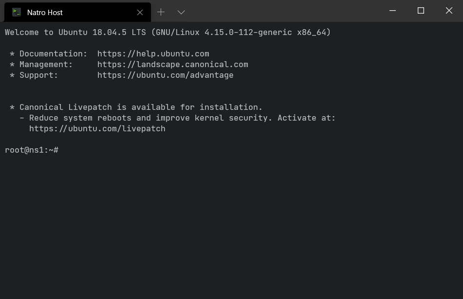

# ⛅ Sunucu Yönetimi

## 💻 Sunucu Kiralama

* 🔗 [DigitalOcean](https://www.google.com/url?sa=t&rct=j&q=&esrc=s&source=web&cd=&cad=rja&uact=8&ved=2ahUKEwi1n_Lh2IbsAhUEaRUIHQG_DNcQFjAAegQIBhAC&url=https%3A%2F%2Fwww.digitalocean.com%2F&usg=AOvVaw2Kbi_PqpnTiK49rdUPGt9G) sitesi üzerinden hesap açıp GitHub veya Google ile bağlayabilirsin
* 💳Kredi kartı bilgilerini alıp 1$ çekim işlemi yaparak sahte bir kullanıcı olmadığını doğrulamaktadırlar
* ⛅ Hesap kaydı tamamlandıktan sonra herhangi bir sunucu alman gerekmekte
* 💵[GitHub Student Package](https://education.github.com/pack/offers?sort=popularity&tag=Cloud) alanından alınan Promo code kısmını sunucu oluşturduktan sonra [Billing](https://cloud.digitalocean.com/account/billing) alanından girmen gerekmekte

## 🔌 Sunucuya Bağlanma

* `ssh -l <username> <ip>` veya `ssh <user>:<IP>` komutu ile sunucuya bağlanılır ve şifre girilir
* Sunucuya bağlanma sırasında terminal oturumu açılmaktadır
* Oturum kapandığında terminal de sonlanır, yani bağlantıdan çıkarsanız tüm işler sonlanır
* Bunu engellemek için `sudo apt install tmux` komutu ile `tmux` aracını indirin \(`nohup` uğraştırıcı 😢\)
* `tmux` ile terminal oturumu içerisinde yeni bir process başlatılmakta ve oturum kapansa da devam etmektedir


‍🧙‍♂ Detaylı bilgi için [How to run a Python script in the cloud?](https://medium.com/@andras1000_18467/how-to-run-a-python-script-in-the-cloud-e486eef96ac3) yazısına bakınız


## 🔒 Sunucuya Şifresiz Bağlanma




```bash
cd ~
$USER = Read-Host 'Username'
$IP = Read-Host 'IP adress'
$KEY_ID = Read-Host 'Key ID'
$KEY_PATH = ".ssh/${KEY_ID}_ecdsa"
ssh-keygen -t ecdsa -b 521 -f ${KEY_PATH}
Get-Service -Name ssh-agent | Set-Service -StartupType Manual
Start-Service ssh-agent
ssh-add ${KEY_PATH}

$pub = (Get-Content ~/${KEY_PATH}.pub)
ssh ${USER}@${IP} "\
    mkdir -p ~/.ssh && \
    echo $pub >> .ssh/authorized_keys && \
    chmod 700 ~/.ssh && \
    chmod 600 ~/.ssh/authorized_keys"

```





```bash
#!/usr/bin/bash

read -p 'Username: ' USER
read -p 'IP adress: ' IP
read -p 'Key ID: : ' KEY_ID
KEY_PATH="./.ssh/${KEY_ID}_ecdsa"
ssh-keygen -t ecdsa -b 521 -f ${KEY_PATH}
ssh ${USER}@${IP} "\
    mkdir -p ~/.ssh && \
    echo \"`cat ${KEY_PATH}.pub`\" && \
    chmod 700 ~/.ssh && \
    chmod 600 ~/.ssh/authorized_keys"
```




* 🧐 `ssh ${USER}@${IP}`komutu ile `OpenSSH` varlığını kontrol edil, tepki veriyorsa vardır
* 🔑 `ssh-keygen -t ecdsa -b 521 -f ${KEY_PATH}` komutu ile `ssh` anahtarı oluşturun
  * SSH, secure shell anlamına gelir ve uzaktan terminal yönetim protokoldür
  * SSH anahtarlarından `pub` uzantılı olan açık anahtardır ve sunucuya aktarılması gerekir
  * Diğer anahtar kapalı olandır ve **paylaşılmaması** gerekmektedir
* ✴️ Bu adımlar **sadece Windows kullanıcıları** tarafından `powershell` üzerinden yapılmalıdır
  * 📢 `Get-Service -Name ssh-agent | Set-Service -StartupType AutomaticDelayedStart` komutu ile `ssh` servisini gecikmeli olarak otomatik başlatabilmek için yapılandırın
  * 👮‍♂️ Eğer servis otomatik başlatılmazsa her ssh bağlantısı için yeniden başlatmanız gerekir
  * ⚙️ `Start-Service ssh-agent` komutu ile ssh servisini başlatın
  * ➕ `ssh-add ${KEY_PATH}` komutu ile `ssh`anahtarını  `keystores` içerisine ekleyin
  * Kapalı anahtarınız `keystores` içerinde saklanır
  * Sunucu bağlantılarında bu anahtar deposu kullanılır
* 🚚 `ssh ${USER}@${IP} "\` komutunu yazın ve ardından alttaki komutları girin
  * 📂`mkdir -p ~/.ssh && \` ile sunucuda `ssh`antahtarları dizini yoksa oluşturun
  * ➕`echo (Get-Content ${KEY_PATH}.pub) >> .ssh/authorized_keys && \` ile açık anahtarınızı sunucuda onaylı anahtar listesine ekleyin
  * 🐧`echo \"cat ${KEY_PATH}.pub\" && \` komutu ile **Linux işletim sistemini kullananlar** açık anahtarı ekleyebilir
  * 👮‍♂️ `chmod 700 ~/.ssh && \` komutu ile `ssh`dizinini yetkilendirin
  * 👮‍♂️ `chmod 600 ~/.ssh/authorized_keys"` komutu ile anahtarların olduğu dosyaya okunabilmesi için izinleri verin


‍🧙‍♂ Detaylı bilgi için 

* [SSH Login Without a Password](https://howchoo.com/g/mmu5ngfimjk/ssh-login-without-password) 
* [Starting ssh-agent on Windows 10 fails: “unable to start ssh-agent service, error :1058”](https://stackoverflow.com/a/53606760/9770490)
* [How to append authorized\_keys on the remote server with id\_rsa.pub key](https://stackoverflow.com/a/23599377/9770490)
* [ssh-agent: agent returned different signature type](https://github.com/PowerShell/Win32-OpenSSH/issues/1263#issuecomment-590947232)

alanlarına bakabilirsin.


## 🖤 Windows Terminal ile Bağlanma



* ⚙️ Terminal üzerinden resimdeki gibi sunuya bağlanmak için [Windows Terminal](https://aka.ms/terminal) ayarlarını açın
* 🔨 Yapılandırma dosyasında `profiles` içerisindeki `list` alanına alttaki ayarları ekleyin


```javascript
{
    "guid": "{4dc7203f-1c35-4058-8a46-1a2d4989fbe7}", // Eşsiz GUID değeri
    "name": "",  // Sekme adı
    "suppressApplicationTitle": true,  // Tab ismini sabit yapar
    "icon": "",  // Bu alana belirlediğiniz ikonu koyun
    "commandline": "ssh root@<IP>",  // IP alanına ip adresinizi yazın
    "hidden": false
}
```


## 🕐 Zaman Ayarı Yapma

* NTP \(network time protocol\) ayarlarını yapmak için `apt-get install ntp ntpdate` komutu ile `ntpdate` paketini kurun
* `ntpdate time.ume.tubitak.gov.tr` ile Tubitak NTP sunucusuna bağlantı yapın
* `service ntp restart` komutu ile yeniden başlatın
* `date` komutu ile tarihi görüntüleyebilirsiniz
* `tzselect` komutu ile zaman bölgesini de seçebiliriz


‍🧙‍♂ Detaylı bilgi için [Linux zaman sunucusu ayarlama](https://gencbilisim.net/linux-zaman-sunucusu-ayarlama/) alanına bakabilirsin.


## `⏳ tmux` ile Uzun Süreli İşlemler

* `tmux` komutu ile yeni bir terminal açtırın ve oraya komutunuzu yazın
* ✲ Ctrl + B, D kısayolu ile ana terminalinize geçin
* Artık oturumu kapatsanız bile `tmux` ile açılan terminaldeki işlemler devam etmektedir
* `tmux attach` komutu ile son terminale bağlanabilirsin
* Terminal işini sonlandırmak için ✲ Ctrl + B, : kısayoluna basıp `kill-session` komutunu yazın


‍🧙‍♂ Detaylı bilgi için [Getting started with Tmux](https://linuxize.com/post/getting-started-with-tmux/) alanına bakabilirsin.


## 🐍 Python Kurulumu

* Sunucularda python default olarak olur ama `pip` ve `venv` kurulu olmaz
* `sudo apt install python3-pip` ile pip kurulur
* `sudo apt install python3-venv` ile sanal ortam oluşturma aracı kurulur
* `pip` python paketlerinin indirilmesine yardımcı olan araçtır
* `venv` sanal python ortamları oluşturarak sistemin python paketlerinin bozulmasını engeller

